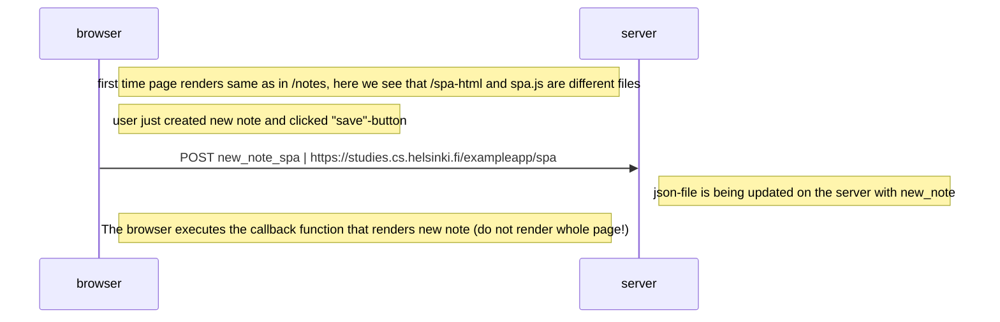

```mermaid
sequenceDiagram
    participant browser
    participant server

    note right of browser: first time page renders same as in /notes, here we see that /spa-html and spa.js are different files

    Note right of browser: user just created new note and clicked "save"-button
    browser->>server: POST new_note_spa | https://studies.cs.helsinki.fi/exampleapp/spa
    Note right of server: json-file is being updated on the server with new_note


    Note right of browser: The browser executes the callback function that renders new note (do not render whole page!)
```
